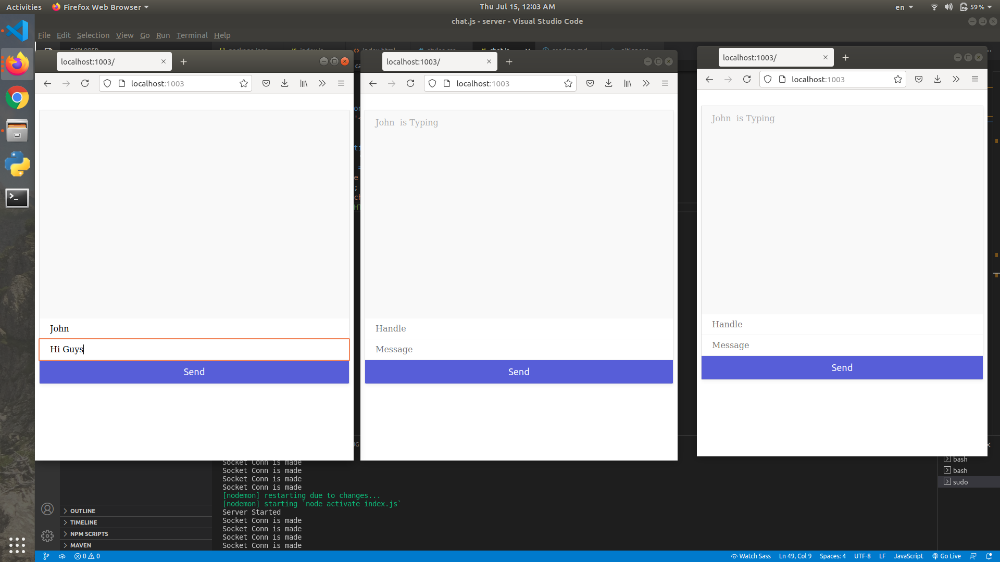
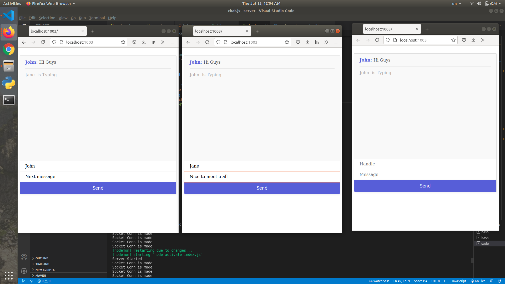

# Group Chat App

A group chat application made using Socket IO and node JS.

# Steps to setup 

1. Clone the repo.   

2. install node JS from here https://nodejs.org/en/download/  

3. Go inside the repo and type:  
    `npm i nodemon --save`  

4. Run nodemon server using:  
    `nodemon activate`  

5. application will be available on http://localhost:1003  

# Workflow

1. open multiple browser windows with same url  
2. Type handle and message in on of them, click send. Message will be boadcasted to other users.  

# images
  
  

# References
1. The net Ninja tutorial